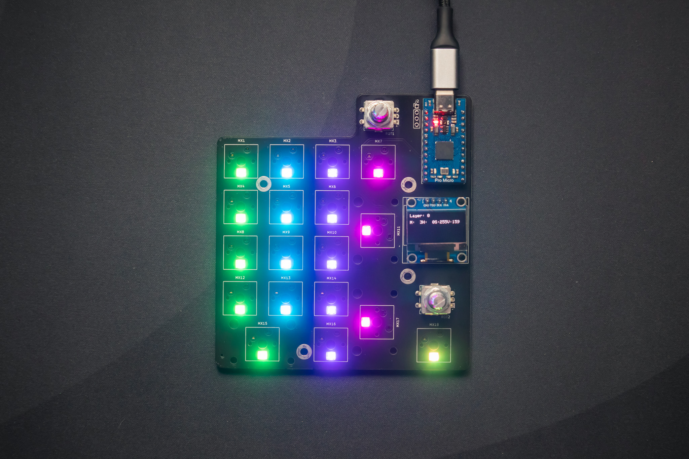

# [numpad](https://kb.ht12345.xyz/np0)
[![CC BY-NC-SA 4.0][cc-by-nc-sa-shield]][cc-by-nc-sa]

### Numpad with alt key, 2 rotary encoders, and OLED display. Designed to be used with a pro micro.

## Specs:
- 2 Rotary Encoders
- 128x64 OLED display
- Per-key RGB matrix lighting
- Kailh Hotswap sockets
- QMK and Vial support

---
[The layout on keyboard layout editor](http://www.keyboard-layout-editor.com/#/gists/e6918e3b4176bcc28b69d0d3c7fc73e4)
[Photo gallery on @howardt12345](https://www.instagram.com/p/CbOJYpYOiaQ/)
[QMK (Pro Micro)](https://github.com/howardt12345/qmk_firmware/tree/ht12345/numpad/keyboards/ht12345/numpad)
[Vial (Pro Micro, KB2040)](https://github.com/howardt12345/vial-qmk/tree/ht12345/numpad/keyboards/ht12345/numpad)

---
## All of the files in this repository, including the PCBs, are provided without liability and without any guarantee with regards to functionality. Any production files and prototypes from this project are provided without warranty of any kind.

---

**This work is licensed under a** [Creative Commons Attribution-NonCommercial-ShareAlike 4.0 International License][cc-by-nc-sa].

[![CC BY-NC-SA 4.0][cc-by-nc-sa-image]][cc-by-nc-sa]

[cc-by-nc-sa]: http://creativecommons.org/licenses/by-nc-sa/4.0/
[cc-by-nc-sa-image]: https://licensebuttons.net/l/by-nc-sa/4.0/88x31.png
[cc-by-nc-sa-shield]: https://img.shields.io/badge/License-CC%20BY--NC--SA%204.0-lightgrey.svg